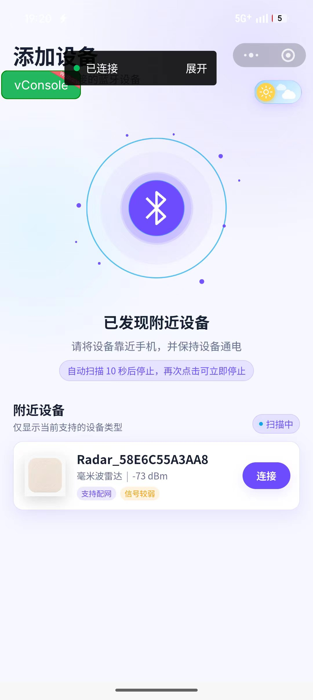
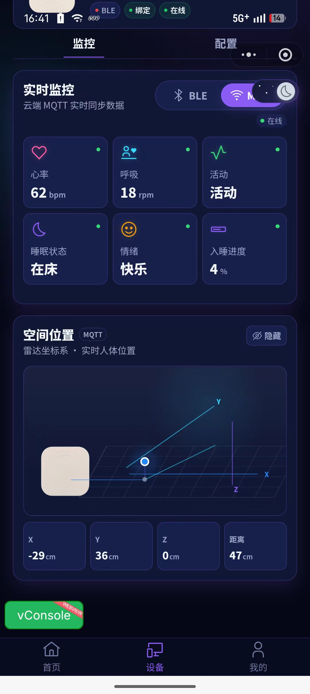
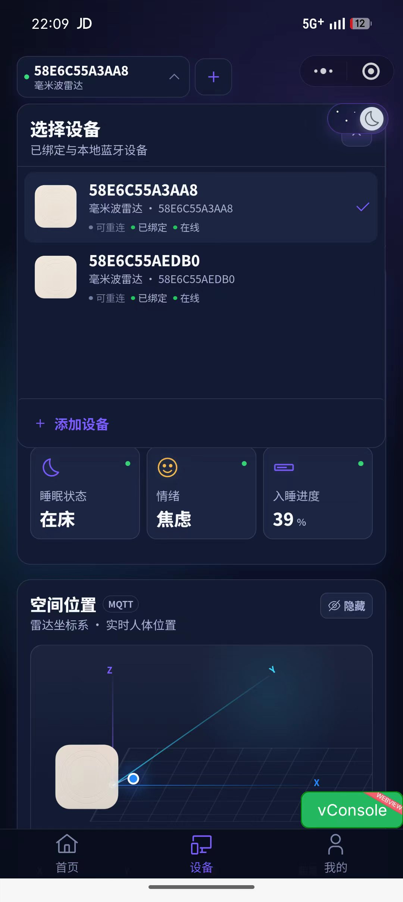
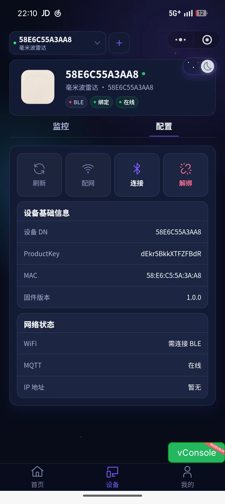
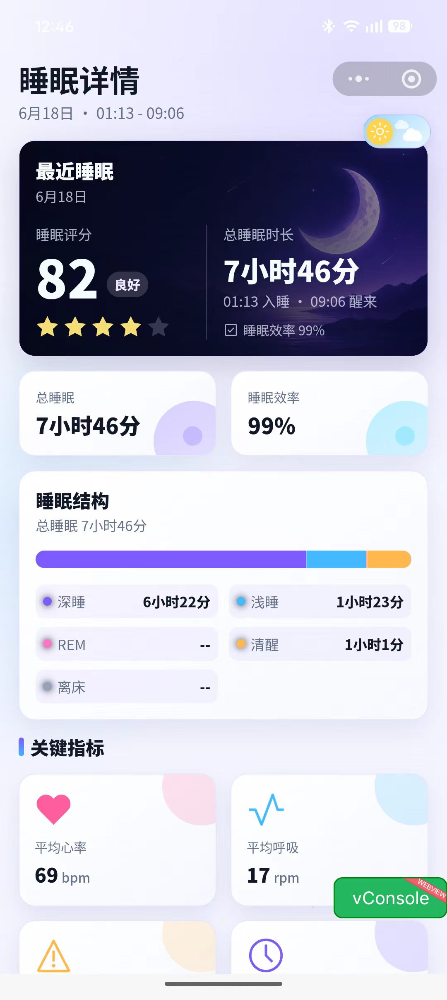
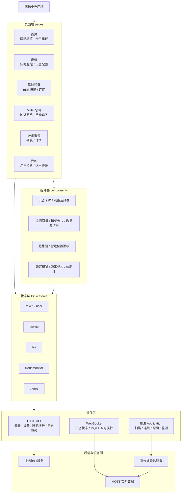
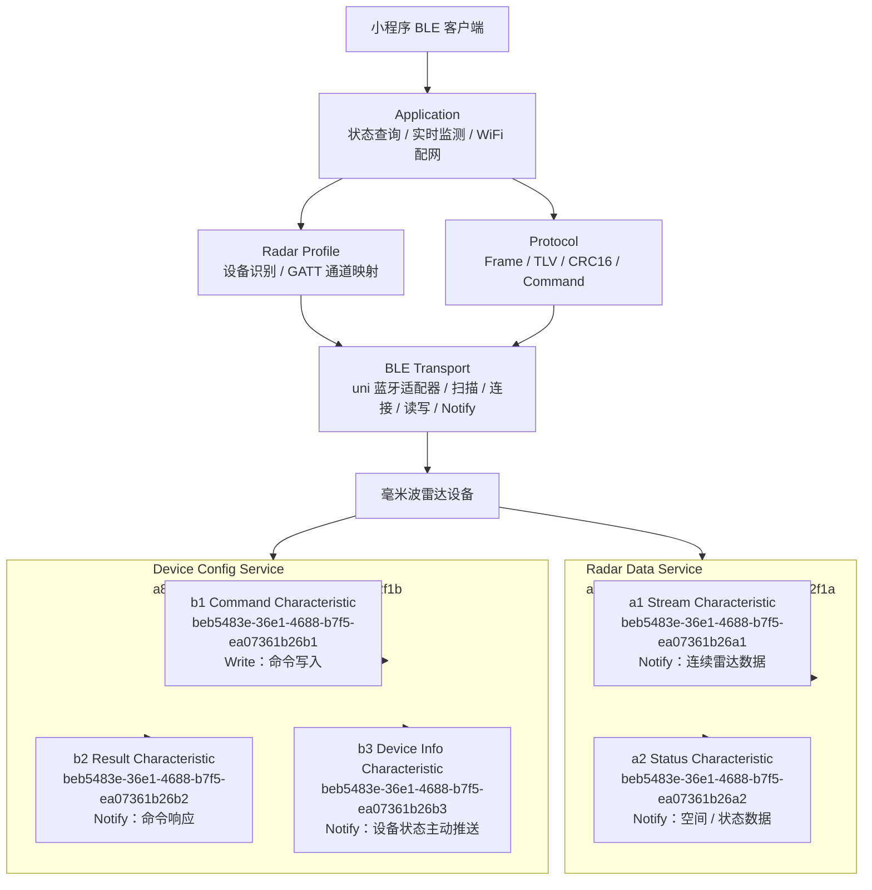

# 智联未来

## 项目简介

智联未来是一款面向 IoT 毫米波雷达设备的微信小程序，主要用于设备接入、实时体征监测、睡眠健康报告和个人设备管理。项目基于 `uni-app`、`Vue 3`、`TypeScript` 与 `unibest` 模板开发，结合 BLE 本地通信、云端 MQTT 实时数据和后端业务接口，形成从设备发现、设备配网、账号绑定到健康数据展示的完整闭环。

小程序当前围绕睡眠健康场景展开，支持通过 BLE 发现并连接雷达设备，读取设备身份与状态，完成 WiFi 配网；设备绑定到用户账号后，可通过云端实时订阅设备状态与体征数据，并展示睡眠报告、历史趋势、空间位置等信息。

## 项目预览

<table>
  <tr>
    <td align="center">
      
      <br />
      <sub>添加设备 / BLE 扫描</sub>
    </td>
    <td align="center">
      
      <br />
      <sub>实时监控 / MQTT 数据</sub>
    </td>
    <td align="center">
      
      <br />
      <sub>设备切换 / 多设备管理</sub>
    </td>
  </tr>
  <tr>
    <td align="center">
      
      <br />
      <sub>设备配置 / 绑定状态</sub>
    </td>
    <td align="center">
      
      <br />
      <sub>睡眠详情 / 健康报告</sub>
    </td>
    <td align="center"></td>
  </tr>
</table>

## 核心功能

- 微信登录与用户会话管理：支持微信一键登录、登录态持久化、Token 刷新和路由登录拦截。
- 设备发现与连接：通过 BLE 扫描附近雷达设备，识别支持的设备类型并建立本地蓝牙连接。
- 设备绑定与管理：将设备的 `productKey + dn` 绑定到当前用户账号，合并展示云端设备与本地 BLE 历史设备。
- WiFi 配网：通过 BLE 向设备下发 WiFi 信息，支持附近 WiFi、设备已保存 WiFi 和手动输入 SSID。
- 实时体征监测：支持 BLE 近场数据与云端 MQTT 数据两种监测源，展示心率、呼吸、活动、睡眠状态、情绪、入睡进度等指标。
- 雷达空间位置：展示人体在雷达坐标系中的 X/Y/Z 坐标和距离信息。
- 历史趋势：按时间范围查看心率、呼吸等设备属性的历史趋势。
- 睡眠报告：展示最近睡眠概览、30 天报告列表、睡眠详情、睡眠结构、关键指标和睡眠评分。
- 主题与个人中心：支持亮色/暗色主题切换、头像上传、个人信息展示和退出登录。

## 技术架构



## BLE 蓝牙架构



BLE 通信按分层组织：

- `transport`：封装 uni 蓝牙 API，负责适配器、扫描、连接、特征值写入和 Notify 监听。
- `profiles`：描述雷达设备的识别规则、Service UUID、Characteristic UUID 与上层通信角色。
- `protocol`：实现帧格式、TLV 编解码、CRC16 校验、命令码和状态码定义。
- `application`：组织扫描设备、连接设备、查询状态、启动雷达实时监测、扫描 WiFi、下发 WiFi 配网等业务动作。

## 目录结构

```text
src
├─ api                 # HTTP 接口封装，包含登录、设备、睡眠报告、趋势数据等接口
├─ ble                 # BLE 蓝牙通信能力，包含 transport、profiles、protocol、application 分层
├─ components          # 业务组件，包含设备卡片、监测面板、睡眠卡片、趋势图等
├─ http                # 请求封装、响应处理、Token 刷新与错误处理
├─ pages               # 页面入口：首页、设备、添加设备、WiFi 配网、睡眠报告、我的
├─ router              # 路由拦截与登录跳转控制
├─ store               # Pinia 状态管理，包含 token、user、device、ble、cloudMonitor、theme
├─ style               # 全局样式与亮色/暗色主题变量
├─ tabbar              # 自定义 TabBar 配置与状态
├─ utils               # 通用工具函数与睡眠数据格式化
└─ websocket           # 设备实时数据 WebSocket 客户端
```

## 核心业务流程

1. 登录与启动
   用户通过微信一键登录获取 Token，小程序启动后加载已绑定设备，并在存在云端设备时订阅设备在线状态。

2. 添加设备
   小程序开启 BLE 扫描，按照雷达设备 Profile 匹配附近设备；连接成功后查询设备身份与状态，启动雷达实时监测，并把本地 BLE 连接记录保存到设备列表。

3. WiFi 配网
   用户在已连接 BLE 的前提下进入 WiFi 配网页，可扫描附近 WiFi、读取设备已保存 WiFi，或手动输入 SSID 与密码；配网命令通过 BLE 写入设备配置服务。

4. 设备绑定
   小程序读取设备的 `productKey` 与 `dn`，调用后端绑定接口，将本地发现的雷达设备绑定到当前用户账号。

5. 实时监测
   设备页支持 BLE 与 MQTT 两种数据源。BLE 用于近场连接与本地实时数据，MQTT 通过 WebSocket 订阅云端设备属性，页面统一展示心率、呼吸、活动、睡眠状态、情绪、入睡进度和空间位置。

6. 睡眠报告
   首页展示最新睡眠报告摘要，睡眠报告页展示最近 30 天记录，详情页展示评分、总睡眠时长、睡眠效率、睡眠结构、平均心率、平均呼吸、呼吸暂停、入睡耗时、醒来次数和睡眠周期等指标。

## 技术栈

- 框架：`uni-app`、`Vue 3`、`TypeScript`、`Vite`
- 模板基础：`unibest`
- 状态管理：`Pinia`、`pinia-plugin-persistedstate`
- UI 与样式：`wot-ui-v2`、`UnoCSS`、`SCSS`
- 图表：`ECharts`、`lime-echart`
- 网络通信：`uni.request`、自定义 HTTP 封装、WebSocket 实时订阅
- 蓝牙通信：微信小程序 BLE API、GATT Service/Characteristic 映射、自定义 Frame/TLV 协议
- 目标平台：微信小程序
